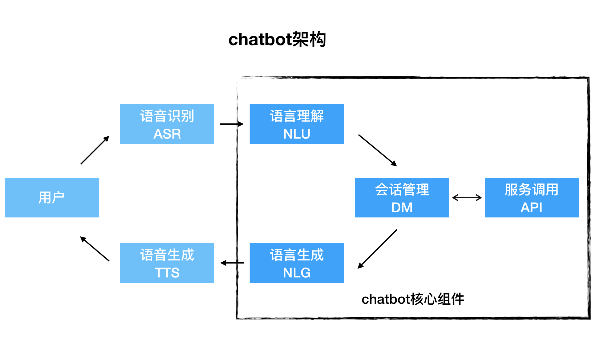
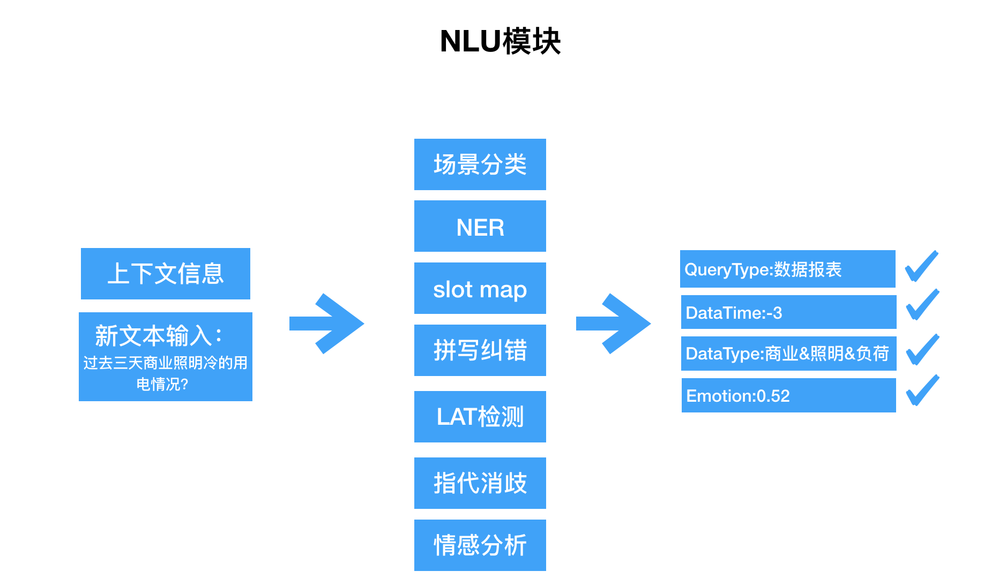
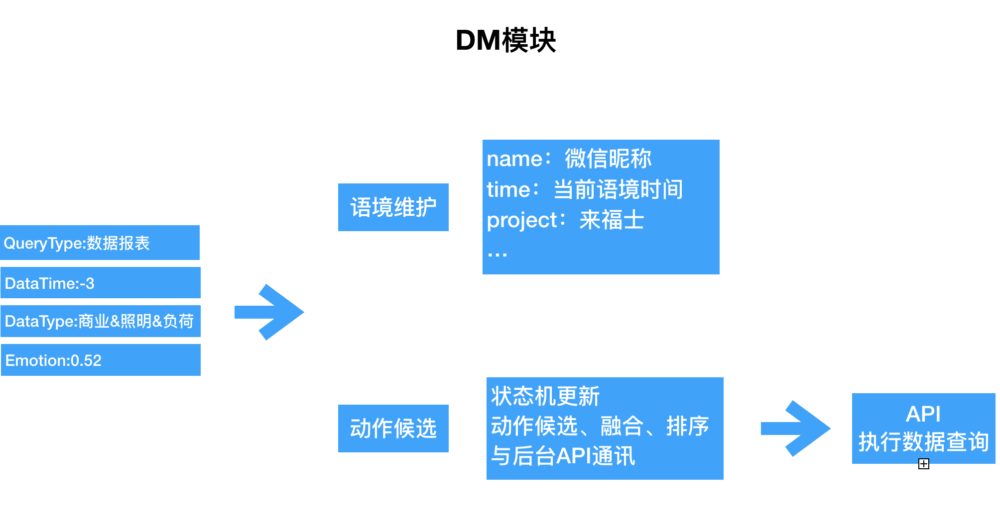
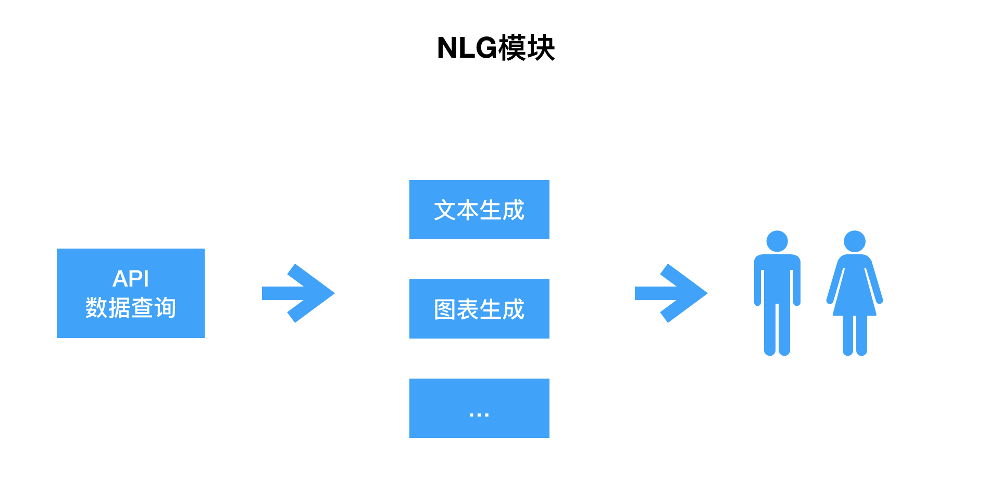

## 2.1 架构设计

### 架构概览

　　一套完成的chatbot应该包含上图所示组件，其中ASR、TTS较为独立，可以采用第三方接口实现，NLU、DM、NLG是chatbot的业务核心组件。NLU即自然语言理解，负责文本的结构化表示、语意理解、场景分类、情感分析、消歧等；DM负责全程会话管理及动作调用；NLG模块返回输出结果。

### 自然语言理解模块

### 会话管理模块

三种典型DM架构：

+ Slot filling

　　将对话建模成填槽，每个API查询都需要有一定槽/参数输入，缺什么问什么，有些槽需要上下文维护、背景语境支持等。简单，快速见效，适合API查询。

+ Tree-based

　　槽模型升级版，不同槽位形成树状结构，一个节点槽位是否filling取决于子节点和子节点间的关系。

+ Graph-based

　　维护一个有限状态机，状态决定多做，输入会改变状态。复杂但灵活。

### 自然语言生成模块

