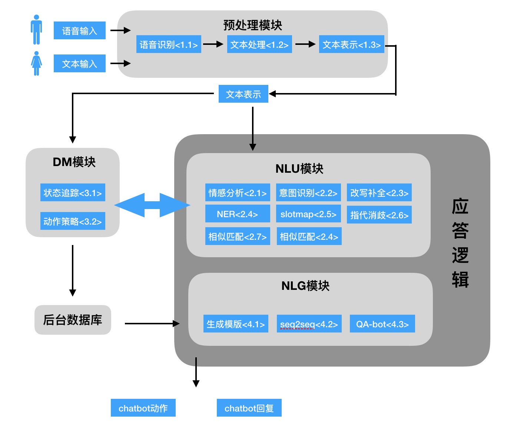

### 2.2 架构及主要组件

#### 架构概览

#### 文本分类模型

> 适用组件：情感分析<2.1>，意图识别<2.2>

> 参考论文：  
+ [Convolutional Neural Networks for Sentence Classification](https://arxiv.org/abs/1408.5882)  
+ [A Sensitivity Analysis of  Convolutional Neural Networks for Sentence Classification]()  
+ [Character-level convolutional networks for text classification](http://papers.nips.cc/paper/5782-character-level-convolutional-networks-for-text-classification.pdf)
+ [Recurrent Convolutional Neural Networks for Text Classification]()
+ [Deep Unordered Composition Rivals Syntactic Methods for Text Classification]()
+ [Learning Structured Text Representations](https://arxiv.org/abs/1705.09207)
+ [Attentive Convolution]()

**测试评估**

| Model | Corpus | Macro-avg |
| :-: | :-: | :-: |
| CNN | 搜狗10类新闻 | 0.942 |
| GRU | 搜狗10类新闻 | 0.931 |
| LSTM | 搜狗10类新闻 | 0.939 |
| BiGRU | 搜狗10类新闻 | 未实现 |
| CNN-BiGRU | 搜狗10类新闻 | 未实现 |
| CNN-BiLSTM | 搜狗10类新闻 | 未实现 |
| CNN-BiLSTM-Att | 搜狗10类新闻 | 未实现 |

#### 序列标注模型

> 适用组件：NER<2.4>，文本处理-分词<1.2>，文本处理-词性标注<1.2>

**测试评估**

| Model | Corpus | Macro-avg |
| :-: | :-: | :-: |
| CRF++ | 人民日报1998 | 0.822 |
| BiLSTM | 人民日报1998 | 0.811 |
| BiLSTM-CRF | 人民日报1998 | 0.855 |