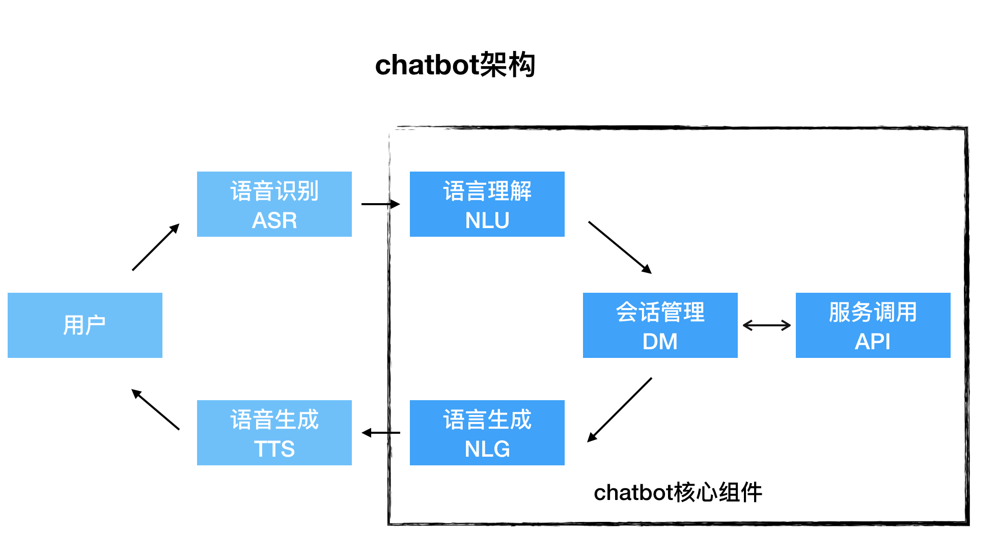

# 聊天机器人开发

***周知瑞@研发中心  
zhouzr@chinawyny.com***

---

　　深入介绍chatbot发展背景、各种类型、主流框架及工业界的应用模式；并针对目前工业界成熟的***任务驱动型多轮对话chatbot***的架构、核心组件、技术细节、衍生知识进行了全面细致梳理。

　　同时，围绕当下万益能源实际业务场景，论证了chatbot的可行性及价值点，提出了一种落地的解决方案和详细设计与实施路径。
